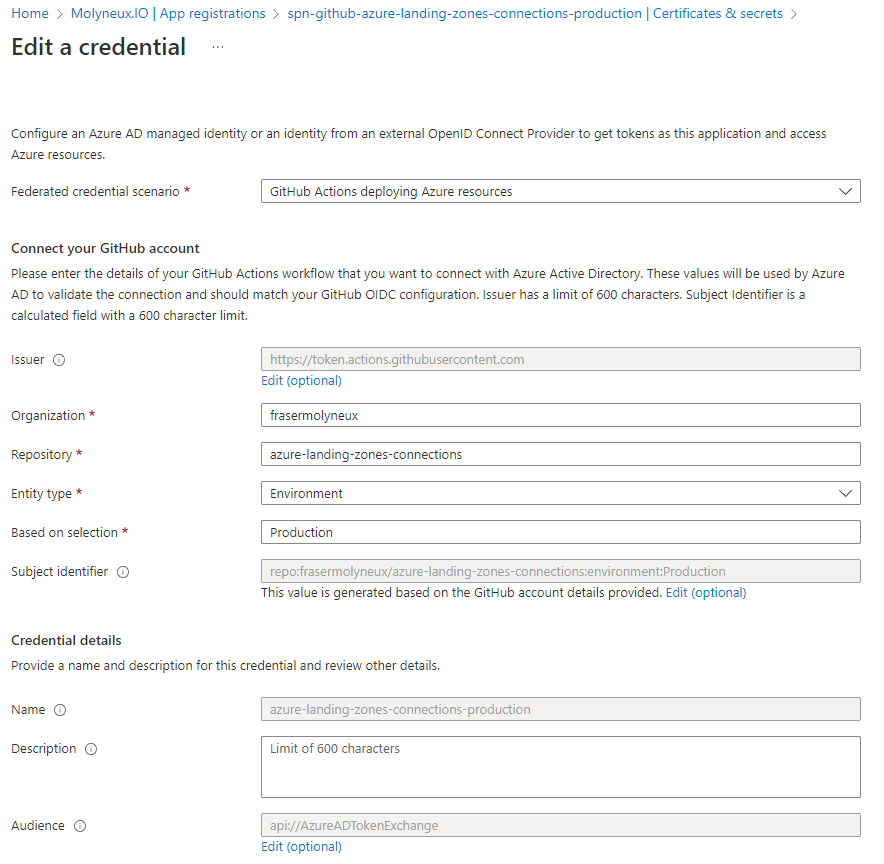
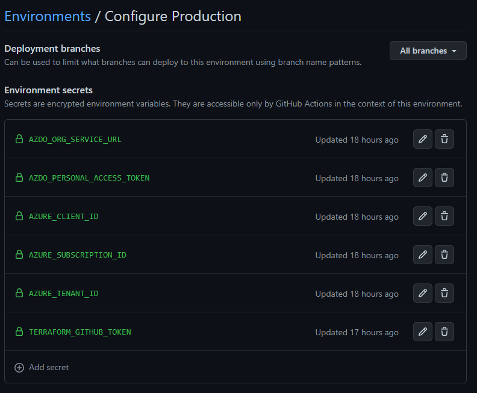

# Platform Workloads

| Stage | Status |
| ----- | ------ |
| Feature Development | [](https://github.com/frasermolyneux/platform-workloads/actions/workflows/feature-development.yml) |
| Release To Production | [](https://github.com/frasermolyneux/platform-workloads/actions/workflows/release-to-production.yml) |

---

## Overview

This repository contains the Terraform code to create the Azure DevOps and GitHub connections for the Azure Landing Zones.

Included in this are the configurations for the service principals in Azure Active Directory alongside their configuration in the Azure DevOps and GitHub connections.

---

## Prerequisites

The following prerequisites are required to run this code:

* An spn has been created for the GitHub connection (`spn-platform-workloads-production` is current production app registration)

* A federated credential using the `GitHub Actions deploying Azure resources` scenario has been created under the app registration:



* The following secrets have been added to the `Production` environment in the GitHub environment:
  * `AZDO_PERSONAL_ACCESS_TOKEN` - This is the PAT for the Azure DevOps organisation for the globaladdy@molyneux.io account
  * `AZURE_CLIENT_ID` - This is the `Application (client) ID` of the `spn-platform-workloads-production` app registration
  * `AZURE_SUBSCRIPTION_ID` - This is the subscription ID of the management subscription
  * `AZURE_TENANT_ID` - This is the `Directory (tenant) ID` of the `spn-platform-workloads-production` app registration
  * `TERRAFORM_GITHUB_TOKEN` - This is the PAT for the GitHub organisation



* There is a requirement that the service principal that runs the workloads deployment ia an owner of the `/` scope.

```powershell
az role assignment create --scope '/' --role 'Owner' --assignee-object-id $(az ad sp list --display-name "spn-platform-workloads-production" --query '[].{id:id}' -o tsv) --assignee-principal-type ServicePrincipal
```

---

## NuGet and SonarCloud Tokens

This repository will create a resource group and key vault to store the NuGet and SonarCloud tokens; these are then injected into the GitHub secrets.

* If the secrets need to be updated this can be done through Key Vault and re-running this workflow.
* If the secrets do not exist (first-time run) then the workflow will fail.

---

## Post Deployment Manual Step

* There is a requirement that the service principal that runs the landing zones deployment is an owner of the `/` scope.

```powershell
az role assignment create --scope '/' --role 'Owner' --assignee-object-id $(az ad sp list --display-name "spn-platform-landing-zones-production" --query '[].{id:id}' -o tsv) --assignee-principal-type ServicePrincipal
```