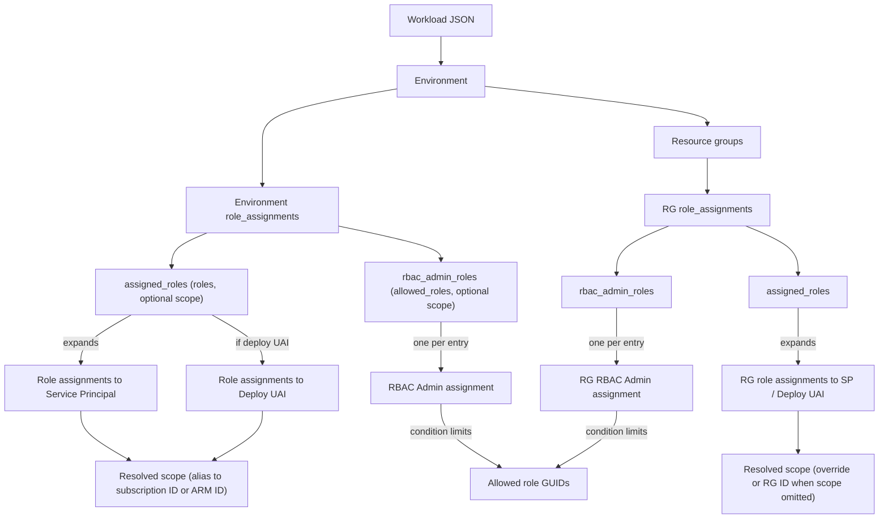

# Role Assignments Reference

Audience: senior engineers designing or reviewing workload configuration.

## Shapes and Levels

### Environment level

```json
{
  "role_assignments": {
    "assigned_roles": [
      { "roles": ["Contributor", "User Access Administrator"] },
      { "scope": "/subscriptions/.../resourceGroups/rg-x", "roles": ["DNS Zone Contributor"] }
    ],
    "rbac_admin_roles": [
      { "allowed_roles": ["Key Vault Secrets Officer"] },
      { "scope": "sub-other", "allowed_roles": ["Storage Blob Data Contributor"] }
    ]
  }
}
```

- If `scope` is omitted, the environment subscription alias is used.
- `assigned_roles` are expanded into Azure role assignments for the workload service principal; when `add_deploy_script_identity=true`, the deploy script UAI receives the same set.
- A `Reader` assignment is auto-added at the environment subscription scope; if you already target that scope, `Reader` is merged into its roles.
- Scopes accept subscription aliases (resolved via `data.azurerm_subscription`) or full ARM IDs.
- `rbac_admin_roles` grant `Role Based Access Control Administrator` on the resolved scope with a condition limiting which role definitions can be written/deleted (the `allowed_roles`).

### Resource-group level

```json
{
  "resource_groups": [
    {
      "name": "rg-{workload}-{env}-{location}",
      "role_assignments": {
        "assigned_roles": [
          { "roles": ["Contributor"] },
          { "scope": "/subscriptions/.../resourceGroups/rg-other", "roles": ["Reader"] }
        ],
        "rbac_admin_roles": [
          { "allowed_roles": ["Storage Blob Data Contributor"] }
        ]
      }
    }
  ]
}
```

- If `scope` is omitted for a resource group role assignment, the resource group ID is used.
- `assigned_roles` apply to the workload service principal (and deploy UAI when enabled).
- `rbac_admin_roles` behave like environment level but scoped to the RG (or override).

## Resolution Rules (Terraform implementation)

- Environment defaults: `scope = coalesce(entry.scope, subscription)`.
- RG defaults: `scope = coalesce(entry.scope, <resource group id>)`.
- Assignment scope: environment uses subscription when scope omitted; RG uses its own ID when scope omitted.
- Subscription alias scopes convert to subscription IDs; ARM IDs pass through.
- Reader auto-add: if no assignment targets the environment subscription, inject `Reader`; if one does, append `Reader` to its roles.
- Identities targeted: workload service principal always; deploy script UAI only when `add_deploy_script_identity=true`.
- RBAC admin: single `Role Based Access Control Administrator` assignment per entry with condition restricting allowed role GUIDs; roles resolved via `data.azurerm_role_definition`.

## Practical Guidance

- Prefer setting an environment `role_assignments.scope` when most roles share the same subscription; set explicit scopes only for exceptions.
- At RG level, set `role_assignments.scope` only when the RG needs to manage roles in a different scope than itself.
- Keep `allowed_roles` minimal; every entry emits a conditional RBAC admin assignment granting delegated rights to manage only those roles.
- Validate aliases in `tfvars` before use; a bad alias breaks scope resolution at plan time.

## Entity Relationships



# Review Notes (current implementation)

- Reader auto-add is implemented in `local.workload_environments` and RG locals; scopes use subscription alias resolution before ARM ID fallback.
- RBAC admin assignments use conditional `Role Based Access Control Administrator` and resolve allowed roles via `azurerm_role_definition` for both env and RG levels.
- Resource group role assignments now use a keyed map to avoid list indexing errors when resolving scopes.
- Deploy script identity receives the same assigned roles only when `add_deploy_script_identity` is enabled; RBAC admin delegation is only for the workload service principal.
